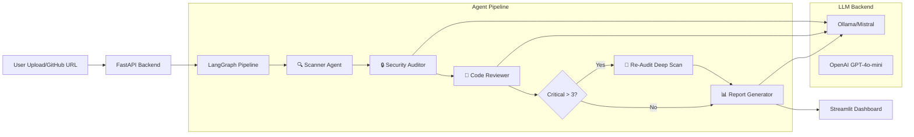

# 🛡️ AI Multi-Agent Code Review & Security Audit System

A multi-agent system that analyzes codebases for security vulnerabilities and code quality issues using LangGraph-orchestrated AI agents.

## Architecture



## Features

- **4 AI Agents** orchestrated via LangGraph state machine
- **OWASP Top 10** vulnerability detection (SQL Injection, XSS, Hardcoded Secrets, etc.)
- **Code Quality Analysis** — anti-patterns, error handling, performance issues
- **Conditional Re-Audit** — automatic deep scan when critical findings exceed threshold
- **Health Score** — 0-100 code health rating with visual gauge
- **Interactive Dashboard** — Streamlit UI with Plotly charts
- **Dual Input** — Upload ZIP or paste GitHub URL
- **Configurable LLM** — Ollama (local) or OpenAI API
- **Export Reports** — Download audit results as JSON

## Tech Stack

| Component | Technology |
|-----------|-----------|
| Backend | Python 3.11+, FastAPI |
| Agent Orchestration | LangGraph (StateGraph) |
| LLM | Ollama/Mistral (local) or OpenAI |
| Frontend | Streamlit |
| Charts | Plotly |
| File Parsing | Python `ast` module |
| Config | python-dotenv |

## Setup Instructions

### 1. Clone the Repository

```bash
git clone <your-repo-url>
cd code-audit-agent
```

### 2. Create Virtual Environment

```bash
python -m venv venv
# Windows
venv\Scripts\activate
# macOS/Linux
source venv/bin/activate
```

### 3. Install Dependencies

```bash
pip install -r requirements.txt
```

### 4. Configure Environment

```bash
cp .env.example .env
# Edit .env with your settings
```

### 5. Start Ollama (if using local LLM)

```bash
ollama pull mistral
ollama serve
```

### 6. Run the Backend

```bash
cd code-audit-agent
uvicorn main:app --host 127.0.0.1 --port 8000 --reload
```

### 7. Run the Frontend

```bash
streamlit run frontend/streamlit_app.py
```

### 8. Demo with Sample App

Upload the `sample_repos/vulnerable_app/` directory as a ZIP, or use the system on any GitHub repo.

## How It Works

### Agent 1: Scanner
Traverses the file tree, identifies key files (routes, models, configs), extracts code snippets, and builds a dependency map.

### Agent 2: Security Auditor
Analyzes code for OWASP Top 10 vulnerabilities including SQL injection, XSS, hardcoded secrets, broken authentication, insecure deserialization, and security misconfiguration.

### Agent 3: Code Reviewer
Checks for anti-patterns (god functions, deep nesting), missing error handling, performance issues (N+1 queries), dead code, and missing type hints.

### Agent 4: Report Generator
Compiles all findings into an executive summary with health score, severity distribution, and actionable recommendations.

### Conditional Re-Audit
If the Security Auditor finds more than 3 Critical-severity vulnerabilities, a deep re-audit agent performs focused analysis on affected files.

## Sample Output

- **Health Score Gauge** — Color-coded 0-100 score
- **Severity Pie Chart** — Distribution of Critical/High/Medium/Low findings
- **File Heatmap** — Which files have the most issues
- **Detailed Finding Cards** — Code snippets, descriptions, and fix suggestions

## Future Enhancements

- Tree-sitter AST parsing for multi-language support
- GitHub Actions integration for CI/CD pipeline
- PR comment bot for automated code review on pull requests
- Historical trend tracking across audits
- Custom rule configuration
- SARIF output format for IDE integration

## ⚠️ Disclaimer

The `sample_repos/vulnerable_app/` directory contains **intentionally vulnerable code** for demonstration purposes only. **DO NOT** deploy or use this code in production.

## License

MIT
